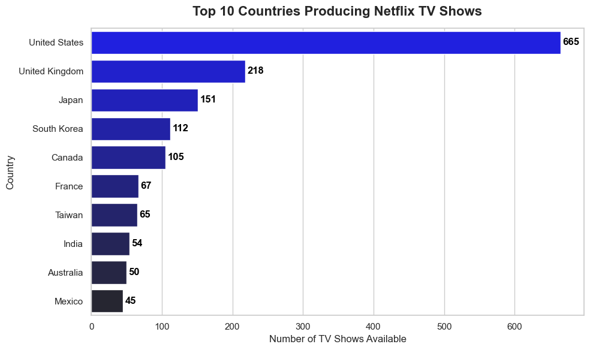

# **Netflix Content Strategy: A Data-Driven Analysis**

## Table of Contents
* [Background & Business Goal](#background--business-goal)
* [Data Overview](#data-overview)
* [Data Preparation & Cleaning](#data-preparation--cleaning)
* [The Strategic Shift & Visualization](#the-strategic-shift--visualization)
* [Global Production Engine Analysis](#global-production-engine-analysis)

## **Background & Business Goal**
Netflix historically relied on a massive catalog of licensed movies to attract subscribers. However, as competitor studios launched their own streaming platforms and pulled their content, Netflix had to adapt its business model.

**Project Goal:** To analyze the historical volume and format of content added to Netflix to identify shifts in their global acquisition and production strategy. By tracking the addition of feature films (Movies) versus episodic content (TV Shows) over time, this project aims to visualize Netflix's pivot toward retention-driven original content and map out their international production hubs.

## **Data Overview**
* **Dataset:** Approximately 6,000 commercial streaming titles available on Netflix.
* **Features:** Content type, ingestion date (`date_added`), release year, age rating, and production metadata (director, cast, country).
* **Limitations:** The dataset lacks internal viewership metrics (hours watched) and specific production budgets. Additionally, co-productions are heavily aggregated in the `country` column, requiring separation for accurate geographical analysis.

## **Data Preparation & Cleaning**
Python was utilized for its powerful data manipulation capabilities using Pandas, alongside Matplotlib and Seaborn for visualization.

### Importing Libraries & Loading Data
```python
import pandas as pd
import numpy as np
import matplotlib.pyplot as plt
import seaborn as sns

# Load the dataset
file_path = 'datasets/netflix_titles_nov_2019.csv'
netflix = pd.read_csv(file_path)
```

### Cleaning & Data Imputation

During the initial audit, a critical issue was discovered: over 640 TV Shows (roughly 51% of all series in the dataset) were missing their `date_added` value. A standard drop would have destroyed the integrity of the time-series analysis.

* Backfilled missing `date_added` values using the `release_year` of the original shows.
* Standardized missing text variables and age ratings to prevent unnecessary data loss.
  
```python

missing_dates = netflix['date_added'].isnull()
netflix.loc[missing_dates, 'date_added'] = 'January 1, ' + netflix.loc[missing_dates, 'release_year'].astype(str)

# Standardizing missing text and ratings
netflix['director'] = netflix['director'].fillna('Unknown')
netflix['cast'] = netflix['cast'].fillna('Unknown')
netflix['country'] = netflix['country'].fillna('Unknown')
netflix['rating'] = netflix['rating'].fillna('NR')

# Final date formatting & adding columns for montha and year
netflix['date_added'] = pd.to_datetime(netflix['date_added'].astype(str).str.strip(), errors='coerce')
netflix['year_added'] = netflix['date_added'].dt.year
netflix['month_added'] = netflix['date_added'].dt.month

# Dropping only the unrecoverable rows
netflix = netflix.dropna(subset=['date_added', 'rating'])
```

### The Strategic Shift & Visualization

To understand Netflix’s evolving content strategy, the dataset was filtered to focus on the modern streaming era (2015–present). Content additions were then aggregated by type to analyze year-over-year trends.

```python
# Aggregating data for modern streaming years
modern_netflix = netflix[netflix['year_added'] >= 2015]
trend_data = modern_netflix.groupby(['year_added', 'type']).size().reset_index(name='content_count')

# Visualizing the strategic pivot
plt.figure(figsize=(12, 6))
sns.set_theme(style="whitegrid")

sns.lineplot(
    data=trend_data, 
    x='year_added', 
    y='content_count', 
    hue='type', 
    marker='o', 
    linewidth=3,
    markersize=8,
    palette=['#db0000', '#564d4d']
)
plt.title('Netflix Content Strategy: Volume of Movies vs. TV Shows Added', fontsize=16, fontweight='bold', pad=15)
plt.xlabel('Year Added to Platform', fontsize=12)
plt.ylabel('Total Volume Added', fontsize=12)
plt.xticks(range(2015, int(modern_netflix['year_added'].max()) + 1))
plt.legend(title='Content Type', title_fontsize='12', fontsize='11')
plt.tight_layout()
plt.show()
```
<p align="center">
  
</p>

**Insight**: While Movies historically dominate the raw volume of content added, their growth began to plateau around 2018. Conversely, TV Show additions display a steady, aggressive climb. This reflects Netflix's multi-billion dollar pivot toward original, binge-able series designed to reduce churn and keep users subscribed long-term.

### Global Production Engine Analysis

Given the aggressive expansion of the TV Show catalog, an analysis was conducted to determine the geographical source of this content. Co-productions were split to accurately count each country's individual contribution.

```python
# Splitting co-productions into individual country rows for accurate counting
tv_shows = netflix[(netflix['type'] == 'TV Show') & (netflix['country'] != 'Unknown')].copy()
tv_shows['country'] = tv_shows['country'].str.split(', ')
tv_countries = tv_shows.explode('country')

# Visualizing the top production hubs
top_10_countries = tv_countries['country'].value_counts().head(10).reset_index()
top_10_countries.columns = ['Country', 'TV_Show_Count']

plt.figure(figsize=(10, 6))
sns.barplot(
    data=top_10_countries, 
    y='Country', 
    x='TV_Show_Count', 
    hue='Country',
    legend=False,
    palette='dark:blue_r' 
)
plt.title('Top 10 Countries Producing Netflix TV Shows', fontsize=16, fontweight='bold', pad=15)
plt.xlabel('Number of TV Shows Available', fontsize=12)
plt.ylabel('Country', fontsize=12)

# Add data labels to the bars
for i, v in enumerate(top_10_countries['TV_Show_Count']):
    plt.text(v + 3, i, str(v), color='black', va='center', fontweight='bold')

plt.tight_layout()
plt.show()
```

<p align="center">
  
</p>

**Insight**: Unsurprisingly, the United States and the UK lead production. However, the massive presence of Japan (Anime) and South Korea (K-Dramas) highlights a hyper-localized global strategy. As the North American market saturates, Netflix relies heavily on international production hubs to drive international subscriber growth.
